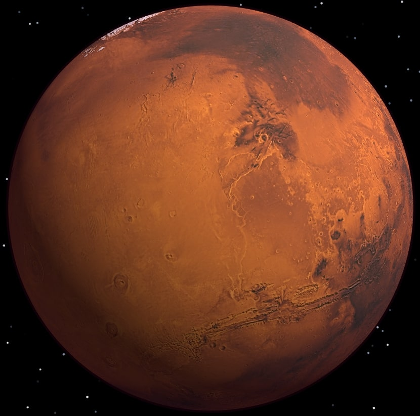
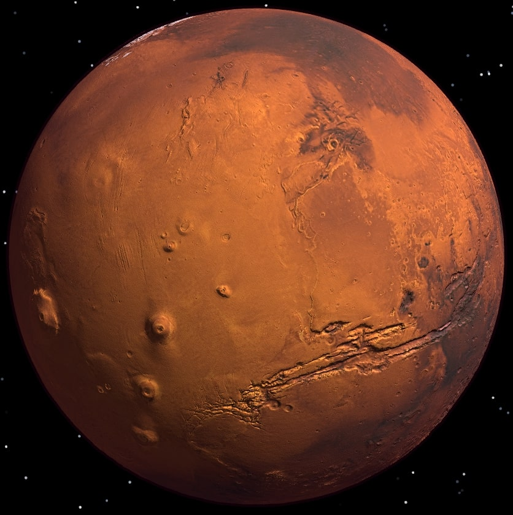

# Mars Render with Three.js

## Overview
This project renders a 3D model of Mars using Three.js along with NASA MOLA and MEDGR data. The model includes adjustable parameters for rotation speed, geometry displacement, and bump mapping.

## Showcase
For this project, I implemented my own custom geometry algorithm. Showcased below are the results of this:
### Mars Render with No Displacement and No Bump

### Mars Render with Displacement and Bump

## Features
- **Rotation Speed**: Adjust the rotation speed of Mars along the Y-axis.
- **Displacement Multiplier**: Amplifies custom geography based on topographic data.
- **Bump Scale**: Adjusts the bump map intensity for additional texture detail.

## Usage
1. Clone this repository: https://github.com/TylerEgloff/Mars-Render-THREE.js
2. Run the repository on a local server
3. Includes pre-built libraries, so no prerequisites necessary